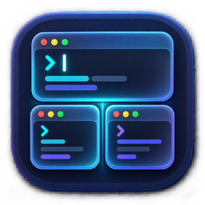
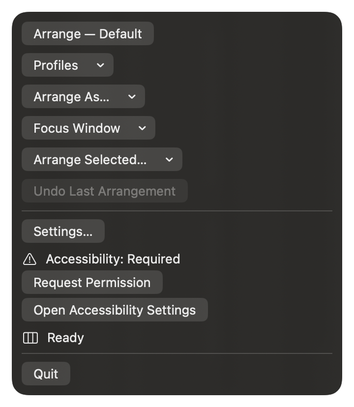
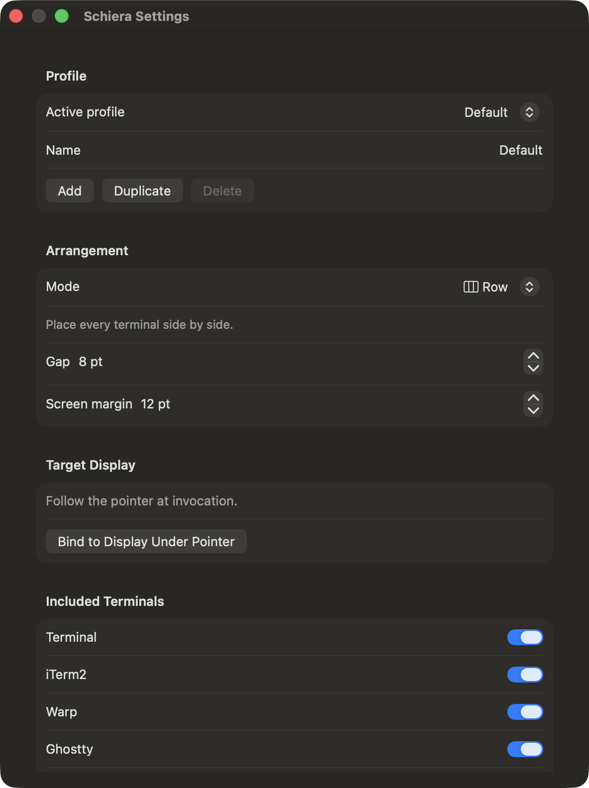

<p align="center">
  
</p>

<h1 align="center">Schiera</h1>

<p align="center">
  Arrange your terminal windows without leaving the macOS menu bar.
</p>

<p align="center">
  <a href="https://github.com/maxcorrads/schiera/actions/workflows/ci.yml"></a>
  <a href="https://github.com/maxcorrads/schiera/releases"></a>
  
  
  
  <a href="LICENSE"></a>
</p>

Schiera is a lightweight macOS menu-bar utility for arranging terminal windows on the display where you are working. It can choose a layout automatically, apply one manually, emphasize a specific terminal, and keep separate arrangements for different monitors or workflows.

It has no main window, no persistent Dock icon, no external dependencies, and no network functionality.

## Screenshots

<p align="center">
  
  &nbsp;&nbsp;&nbsp;
  
</p>

<p align="center">
  <sub>Menu-bar controls and profile settings — captured from Schiera only, with no terminal windows or user content.</sub>
</p>

## Download

[**Download Schiera for macOS from GitHub Releases →**](https://github.com/maxcorrads/schiera/releases)

Release downloads are universal DMGs for Apple silicon and Intel Macs. A filename ending in `-unsigned.dmg` identifies an ad-hoc preview that has not been notarized by Apple; macOS may require approval from **System Settings → Privacy & Security** before the first launch. Releases without that suffix are Developer ID signed and notarized.

Drag **Schiera.app** to the **Applications** shortcut in the disk image, launch it, and then grant Accessibility access when requested.

## Highlights

- **Five layout modes:** Smart, Row, Wrapped Rows, Balanced Grid, and Focus.
- **Automatic or manual control:** let Smart react to the number of windows, or choose any layout directly.
- **Flexible focus selection:** use the active window, the window under the pointer, or choose one from the menu.
- **Profiles:** save terminals, layout, spacing, focus behavior, monitor binding, and shortcut together.
- **Multi-display workflows:** follow the pointer or bind a profile to a particular display.
- **Global shortcuts:** assign shortcuts to profiles and individual layouts.
- **Temporary selection:** include, exclude, or prioritize individual windows without changing a profile.
- **Undo history:** restore previous window arrangements across multiple operations.
- **Launch at Login:** optional and managed with the public macOS service API.
- **Privacy by design:** terminal content, commands, paths, keystrokes, and window titles are never collected or logged.

## Layouts

| Layout | Behavior |
| --- | --- |
| **Smart** | Chooses a layout from the current window count: Row for up to 3 windows, Grid for 4, two wrapped rows for 5–6, three wrapped rows for 7–10, and Grid for larger sets. |
| **Row** | Places every terminal side by side at full usable height. |
| **Wrapped Rows** | Preserves wide terminal shapes across two or three rows. The row count can be automatic or fixed. |
| **Balanced Grid** | Creates near-square, equal-sized cells and centers an incomplete final row. |
| **Focus** | Gives one terminal 50–75% of the usable width and stacks the others beside it. The focused window can be placed on the left or right. |

All layouts use the display's current `visibleFrame` and an optional screen margin, so windows stay clear of the menu bar and Dock. Gaps and margins are configurable from 0 to 64 points.

## Quick start

1. Open `Schiera.xcodeproj` in Xcode 16 or later.
2. Select the shared **Schiera** scheme and run the app.
3. Open Schiera from the menu bar and choose **Request Permission**.
4. Enable Schiera in **System Settings → Privacy & Security → Accessibility**.
5. Open at least two supported terminal windows.
6. Place the pointer on the target display and choose **Arrange — Default**, or press `⌃⌥⌘S`.

Schiera refreshes Accessibility status whenever the app or its menu becomes active. If macOS does not report a permission change immediately, quit the running build and launch it again from Xcode.

## Using Schiera

The menu-bar item provides:

- **Arrange — _Profile_** to apply the active profile.
- **Profiles** to invoke another saved profile without opening Settings.
- **Arrange As…** to apply a layout once without changing the profile.
- **Focus Window** to choose a specific terminal for a Focus arrangement.
- **Arrange Selected…** to temporarily exclude or prioritize windows.
- **Undo Last Arrangement** to step backward through the bounded layout history.
- **Settings…** for profiles, layouts, shortcuts, terminals, displays, Accessibility, Launch at Login, and diagnostics.

Window lists are refreshed explicitly from the menu. Their labels use application names and ordinals rather than terminal titles, process identifiers, or window contents.

## Profiles and displays

Each profile stores:

- profile name;
- layout mode and gap;
- two/three-row preference;
- Focus target, side, and width;
- screen-edge margin;
- included terminal applications;
- optional display binding;
- optional global shortcut.

A bound display is matched by its public display identity. If it is disconnected, Schiera safely falls back to the display under the pointer. Profiles can be created, duplicated, renamed, and deleted from Settings.

## Keyboard shortcuts

The fallback shortcut is `⌃⌥⌘S`. Settings can record:

- a shortcut for each profile;
- a shortcut for each layout mode;
- a default fallback shortcut.

Shortcut registration is transactional: if macOS rejects a new combination, the previously working registration remains active.

## Supported terminals

All supported applications are enabled initially and can be selected independently per profile.

| Application | Recognized bundle identifier(s) |
| --- | --- |
| Terminal | `com.apple.Terminal` |
| iTerm2 | `com.googlecode.iterm2` |
| Warp | `dev.warp.Warp-Stable`, `dev.warp.Warp-Preview`, `dev.warp.Warp` |
| Ghostty | `com.mitchellh.ghostty` |
| Alacritty | `org.alacritty` |
| kitty | `net.kovidgoyal.kitty` |
| WezTerm | `com.github.wez.wezterm` |

## Accessibility

Accessibility access is required to discover, resize, and reposition windows belonging to supported terminal applications. Schiera cannot grant this permission itself and does not inspect or move windows while access is unavailable.

For stable permissions during development, run a consistently signed build. The shared project contains no signing-team identifier. A developer can add local signing overrides in the git-ignored `Schiera.xcodeproj/xcuserdata/LocalSigning.xcconfig`; `Config/Schiera.xcconfig` includes it when present.

## Build and test

Requirements:

- macOS 14.0 Sonoma or later;
- Xcode 16 or later;
- an Accessibility-capable local run for manual window-management testing.

Build and test from the repository root:

```sh
xcodebuild -project Schiera.xcodeproj -scheme Schiera -configuration Debug -destination 'platform=macOS' CODE_SIGNING_ALLOWED=NO build
xcodebuild -project Schiera.xcodeproj -scheme Schiera -configuration Debug -destination 'platform=macOS' CODE_SIGNING_ALLOWED=NO test
```

Run the complete repository, privacy, build, and test verification with:

```sh
./scripts/verify.sh --final
```

Manual macOS checks are documented in [docs/MANUAL_QA.md](docs/MANUAL_QA.md).

GitHub Actions runs the same build and test checks for pushes and pull requests. The release workflow produces a universal DMG, checksum, and optional Developer ID notarization. Maintainer instructions and the required secret names are documented in [docs/RELEASING.md](docs/RELEASING.md).

## Architecture

Schiera separates pure layout geometry from macOS integration:

```text
SwiftUI menu and settings
          │
       AppModel
          │
    ┌─────┼──────────────┬─────────────┐
    │     │              │             │
 Profiles & shortcuts  Window discovery  Layout & undo
                         │
               Accessibility + Core Graphics
```

All Accessibility and Carbon interactions remain on the main actor. Window disappearance is treated as a recoverable per-item failure, allowing an arrangement to continue when another application closes a window mid-operation.

See [docs/ARCHITECTURE.md](docs/ARCHITECTURE.md) for the original component boundaries and [docs/PRIVACY.md](docs/PRIVACY.md) for the complete privacy statement.

## Privacy

Schiera runs entirely on the Mac. It does not contact a server, synchronize through iCloud, include analytics, or use telemetry. Preferences are stored locally in `UserDefaults`; diagnostics contain only local status and aggregate counts.

The application never logs terminal titles, contents, commands, paths, keystrokes, or user-entered terminal data. See [docs/PRIVACY.md](docs/PRIVACY.md) for details.

## Known limitations

- macOS exposes no supported public API that maps an Accessibility window directly to a Space. Schiera correlates Accessibility windows with the public on-screen Core Graphics list, so unusual full-screen, overlapping, borderless, or framework-specific windows may be excluded or ambiguously matched.
- Some terminal applications enforce character-cell increments or minimum dimensions and may slightly adjust a requested frame.
- A shortcut already claimed by macOS or another application cannot be registered.
- Accessibility authorization and Launch at Login approval remain controlled by macOS.
- Downloads ending in `-unsigned.dmg` are ad-hoc previews and are not notarized by Apple. A notarized release requires the maintainer's Developer ID and App Store Connect credentials.

## License

Schiera is available under the [MIT License](LICENSE).
